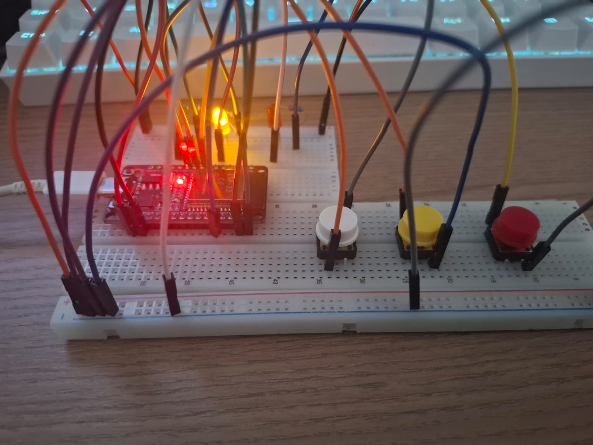
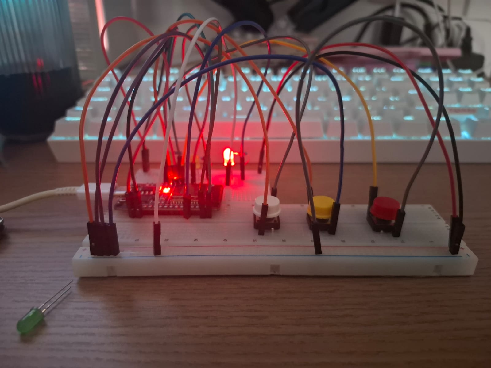
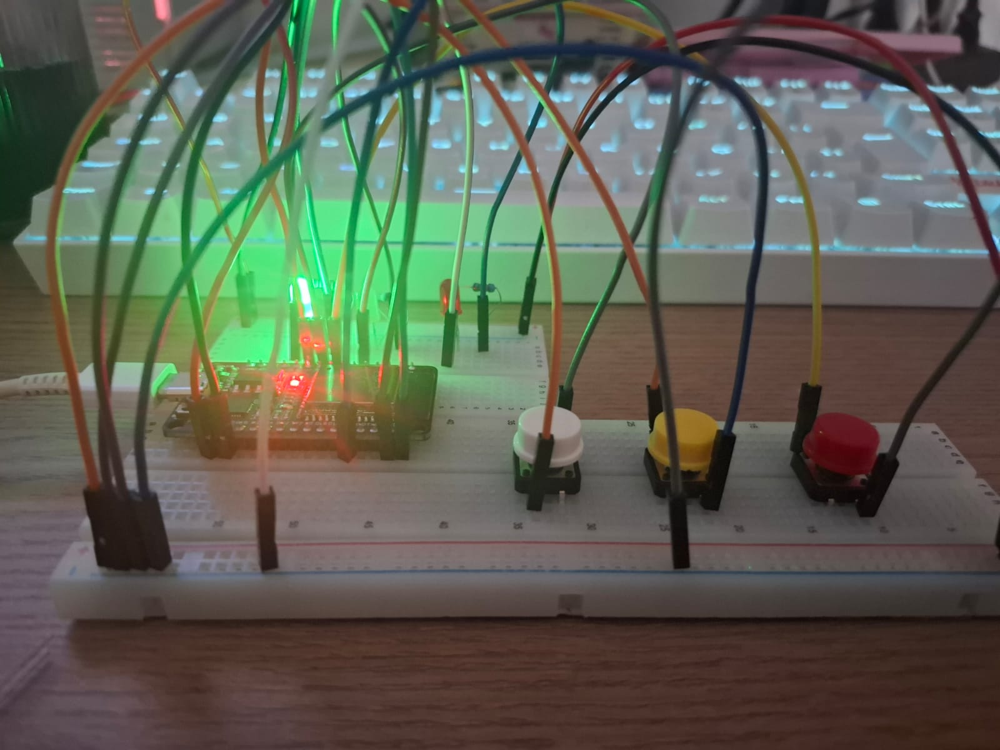
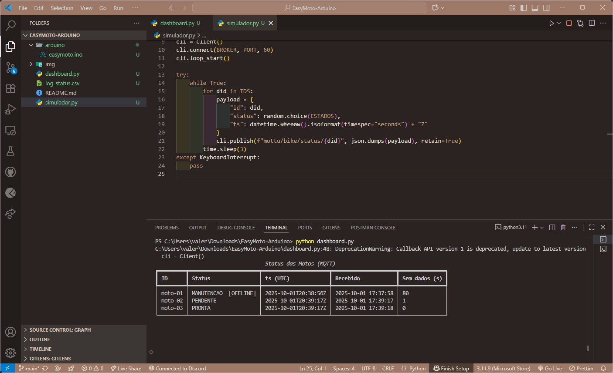

# 📊 EasyMoto IoT – Sprint 3 (Caso IoT)
Um protótipo IoT para status de motos usando um ESP32, 3 botões (simulando eventos/RFID) e 3 LEDs (indicadores).
A cada mudança de estado o ESP32 publica via MQTT um JSON com o status atual, que é consumido por um dashboard em Python e persistido em arquivo CSV.


### Video: 

> Estados: 🟢 **PRONTA** | 🟡 **PENDENTE** | 🔴 **MANUTENÇÃO**


<p align="center">
  
</p>

---

## 📌 Objetivo
Automatizar a **identificação** e o **status** das motos. As leituras dos **botões** (simulando RFID/eventos) mudam o estado dos **LEDs** e são publicadas em **tempo real (MQTT)**. Um **dashboard em Python** exibe os dados ao vivo e grava o **histórico** em arquivo CSV.

---

## 🧱 Arquitetura
- **ESP32** (firmware Arduino):
  - 3 **entradas**: botões (D26, D27, D25) com `INPUT_PULLUP`
  - 3 **saídas**: LEDs (D23, D22, D21) com resistores 220–330 Ω
  - Conecta no **Wi‑Fi 2.4 GHz** e publica em **MQTT**
  - Mensagem **retida** (retained) + **Last Will** (online/offline)
- **Backend leve (MQTT Broker público)**: `broker.hivemq.com:1883`
- **Dashboard Python** (`dashboard.py`): assina os tópicos, mostra tabela em tempo real e **persiste** em `log_status.csv`
- **Simulador Python** (`simulador.py`): cria **moto-02** e **moto-03** para rodar junto com a **moto-01** real

<p align="center">
  
</p>

---

## 🔌 Pinagem & ligações

### LEDs (atuadores)
| LED | Pino ESP32 | Ligação |
|---|---|---|
| Verde | **D23 (GPIO 23)** | D23 → **resistor 220–330 Ω** → **anodo** do LED; **catodo** → **GND** |
| Amarelo | **D22 (GPIO 22)** | D22 → resistor → anodo; catodo → GND |
| Vermelho | **D21 (GPIO 21)** | D21 → resistor → anodo; catodo → GND |

### Botões (sensores)
| Botão | Pino ESP32 | Ligação |
|---|---|---|
| Verde | **D26 (GPIO 26)** | **D26 ↔ botão ↔ GND** (atravessando a fenda do protoboard) |
| Amarelo | **D27 (GPIO 27)** | **D27 ↔ botão ↔ GND** |
| Vermelho | **D25 (GPIO 25)** | **D25 ↔ botão ↔ GND** |

<p align="center">
  
</p>


<p align="center">
  
</p>


---


## 🖥️ Dashboard + Persistência (Python)

### Requisitos
```bash
pip install paho-mqtt rich
```

### Executar
```bash
python dashboard.py
```
- Mostra uma **tabela em tempo real** com `id`, `status`, `ts` e **dados**.  
- Cada mensagem recebida é gravada no **CSV**: `log_status.csv`.

### Simulador
```bash
python simulador.py
```
Cria **moto-02** e **moto-03** publicando a cada ~3 s. Execute **junto** com a **moto-01** real para demonstrar **3 dispositivos** em paralelo.
---
## 👥 Equipe:

* ⭐️ **Valéria Conceição Dos Santos** — RM: **557177**  
* ⭐️ **Mirela Pinheiro Silva Rodrigues** — RM: **558191**
* ⭐️ **Luiz Eduardo Da Silva Pinto** — RM: **555213**

