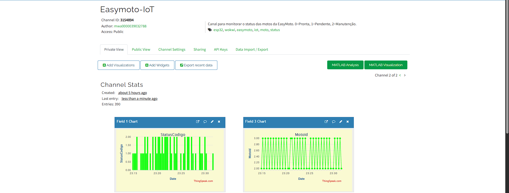

# 📊 EasyMoto IoT – Sprint 4 (IoT + Banco de Dados)

Protótipo IoT para monitorar o **status das motos** da EasyMoto usando:

- **ESP32 (Wokwi)** simulando uma moto  
- **ThingSpeak** como backend IoT + dashboard  
- **Python** para ler o canal e  
- **Oracle** para atualizar a tabela `MOTO` da aplicação EasyMoto.

A cada mudança de estado o ESP32 envia um **HTTP GET** para o ThingSpeak com o código do status, texto, id da moto e origem.  
Um script Python consome a API do ThingSpeak e sincroniza o **STATUS_MOTO** no banco Oracle.

---

### 🎥 Vídeo da Sprint 4

https://youtu.be/TDYQAnHn4rU  

> Estados: 🟢 **PRONTA (0)** | 🟡 **PENDENTE (1)** | 🔴 **MANUTENÇÃO (2)**

---

<p align="center">
  
</p>

---

## 📌 Objetivo

Evoluir o caso IoT da Sprint 3 para uma solução **integrada com o backend da aplicação**:

- Manter o status das motos atualizado em **tempo real** em um **canal IoT na nuvem (ThingSpeak)**.  
- Consumir esses dados via **API REST** usando Python.  
- Atualizar a tabela `MOTO` no **banco Oracle da EasyMoto**, integrando a disciplina de **IoT** com **Banco de Dados**.  

---

## 🧱 Arquitetura – Sprint 4

### 1. Dispositivo IoT (ESP32 – Wokwi)

- Simulação de uma **moto** com um **ESP32** no Wokwi.  
- 3 LEDs:
  - D23 → LED **verde**  (PRONTA)  
  - D22 → LED **amarelo** (PENDENTE)  
  - D21 → LED **vermelho** (MANUTENÇÃO)
- O código do ESP32 executa um “**roteiro do dia**”:
  - alterna entre **PRONTA**, **PENDENTE** e **MANUTENÇÃO** de tempos em tempos;
  - acende somente o LED correspondente ao estado atual;
  - a cada troca, envia um HTTP GET para o ThingSpeak.

**Payload enviado para o canal `Easymoto-IoT`:**

- `field1` → `StatusCodigo` (0, 1, 2)  
- `field2` → `StatusTexto` (`PRONTA`, `PENDENTE`, `MANUTENCAO`)  
- `field3` → `MotoId` (1, 2, 3, …)  
- `field4` → `Origem`/simulador (ex.: `WOKWI`)

O canal foi configurado para suportar **múltiplas motos** (diferentes `MotoId`).  
Durante os testes os ESP32 foram simulados em projetos separados no Wokwi, todos apontando para o mesmo canal.

---

### 2. Backend IoT – ThingSpeak

- Canal privado **Easymoto-IoT** (`CHANNEL_ID = 3154894`).  
- Campos configurados:
  - **Field 1** – `StatusCodigo`  
  - **Field 2** – `StatusTexto`  
  - **Field 3** – `MotoId`  
  - **Field 4** – `Origem` (opcional)  
- Dashboards:
  - **Field 1 Chart** – evolução do status ao longo do tempo.  
  - **Field 3 Chart** – identificação da moto que gerou o evento.  
  - Widgets de “Last Value” para texto (`StatusTexto`).

ThingSpeak funciona como:

- **backend IoT** (recebe os dados do ESP32)  
- **dashboard** para visualização rápida dos estados.

---

### 3. Integração Python → Oracle

Arquivo: `sprint4/sync_iot_banco.py`

Fluxo:

1. Python chama a API REST do ThingSpeak:

   `GET https://api.thingspeak.com/channels/{CHANNEL_ID}/feeds.json?api_key=READ_API_KEY&results=100`

2. Processa os feeds recebidos e monta um dicionário com o **último status de cada moto**:

   ```python
   { moto_id: status_codigo }
   ```

3. Conecta no Oracle:

   - Host: `oracle.fiap.com.br:1521/ORCL`  
   - Usuário: `rm557177`  
   - Senha: `170403`

4. Para cada moto encontrada:

   ```sql
   UPDATE MOTO
      SET STATUS_MOTO = :status
    WHERE ID_MOTO     = :moto_id;
   ```

5. Dá `COMMIT` e faz uma **consulta de verificação** para conferir se o valor foi gravado corretamente.

Dessa forma:

> **ESP32/Wokwi → ThingSpeak → Python → Oracle (tabela MOTO)**

---

## 🔌 Pinagem & Ligações (ESP32 – Wokwi)

### LEDs (atuadores)

| LED       | Pino ESP32      | Ligação                                                                 |
|----------|-----------------|-------------------------------------------------------------------------|
| Verde    | D23 / GPIO23    | D23 → resistor 220–330 Ω → anodo do LED; catodo → GND                   |
| Amarelo  | D22 / GPIO22    | D22 → resistor → anodo; catodo → GND                                   |
| Vermelho | D21 / GPIO21    | D21 → resistor → anodo; catodo → GND                                   |

*(Na Sprint 4 o foco está mais na simulação automática do roteiro do que em botões físicos, mas a pinagem é compatível com o protótipo da Sprint 3.)*

---

## 🖥️ Script de Sincronização (Python)

### Requisitos

```bash
pip install requests oracledb
```

### Configurações principais no código

```python
CHANNEL_ID    = 3154894
READ_API_KEY  = "RVFSGCR8NTA1RSII"
TS_URL        = f"https://api.thingspeak.com/channels/{CHANNEL_ID}/feeds.json"

DB_USER       = "rm557177"
DB_PASSWORD   = "170403"
DB_DSN        = "oracle.fiap.com.br:1521/ORCL"
```

### Execução

Dentro da pasta `sprint4`:

```bash
python sync_iot_banco.py
```

O script:

- busca os últimos feeds do ThingSpeak;
- calcula o **último status de cada MotoId**;
- atualiza o campo `STATUS_MOTO` na tabela `MOTO`;
- mostra no terminal o que foi atualizado e o valor lido de volta do banco.

---

A Sprint 4 reaproveita o conceito de múltiplas motos e histórico, mas migra o backend para **ThingSpeak + Oracle**.

---

## 👥 Equipe

* Valéria Conceição Dos Santos — RM: 557177  
* Mirela Pinheiro Silva Rodrigues — RM: 558191
